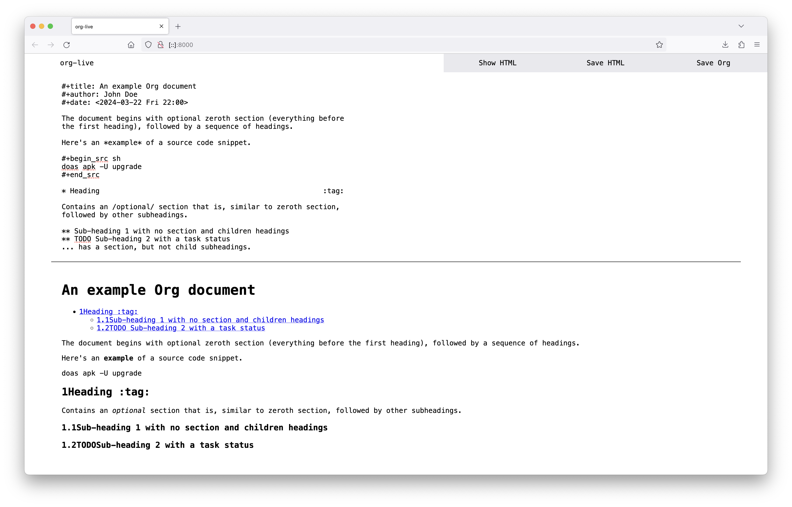
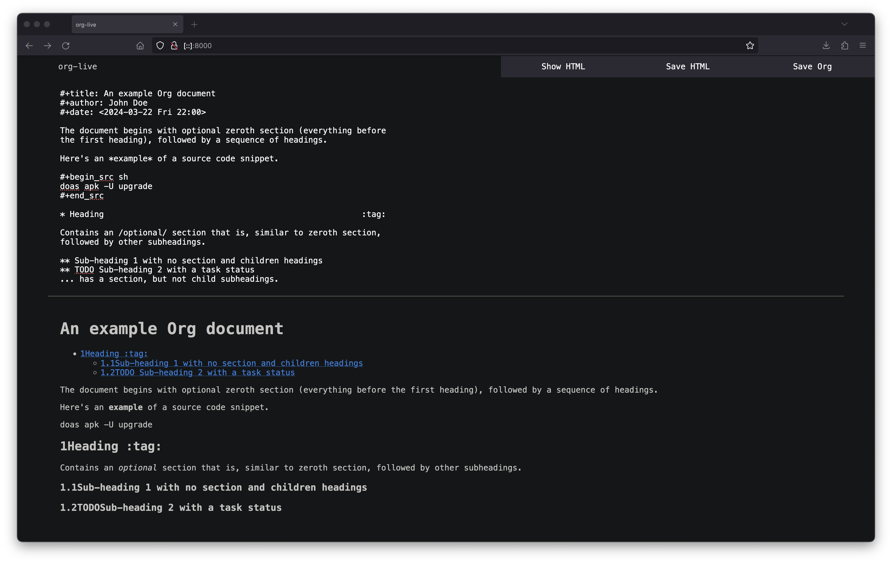

# README

[org-live](https://org.cmc.pub) is a live environment for writing and
editing [org-mode](https://orgmode.org/).

## Functions

- Plain text editor with capitalization, autocorrect, and spellcheck
  support.
- Show HTML output of the written org-mode.
- Download the org-mode content to a local file.
- Download the parsed HTML output to a local file.

## Further Development

### DONE Explore feasability of parsing org-mode to HTML constantly and sending parsed HTML output to a "viewing" pane.

## Screenshots

<figure>

<figcaption>Light Mode</figcaption>
</figure>

<figure>

<figcaption>Dark Mode</figcaption>
</figure>
