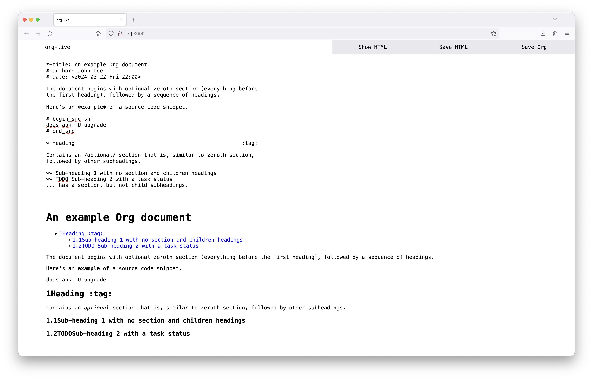
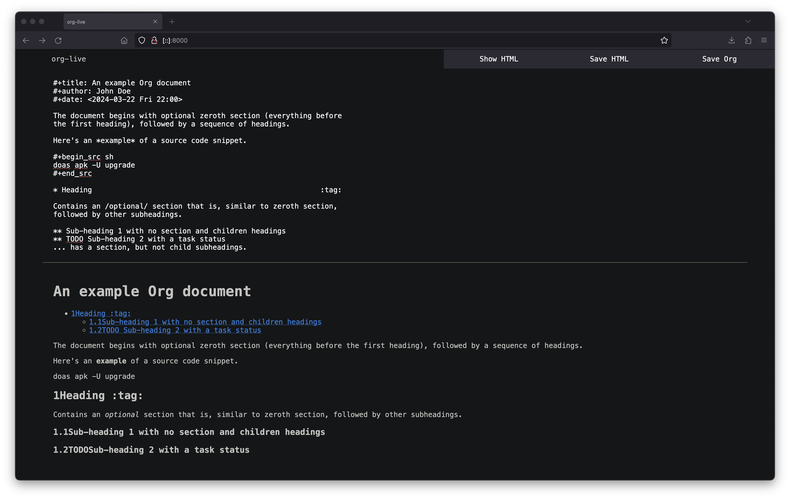

* README

[[https://org.cleberg.net][org-live]] is a live environment for writing and 
editing [[https://orgmode.org/][org-mode]].

** Functions

- Plain text editor with capitalization, autocorrect, and spellcheck support.
- Show HTML output of the written org-mode.
- Download the org-mode content to a local file.
- Download the parsed HTML output to a local file.

** Further Development

TBD - I finished all of the initial features I wanted and have not spent much
time considering what else to add. Contributions always welcome.

** Screenshots

#+caption: Light Mode

#+caption: Dark Mode

